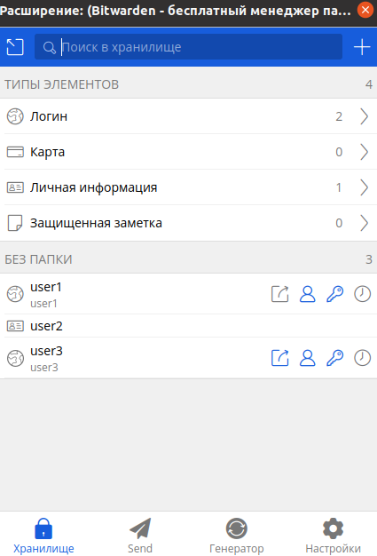
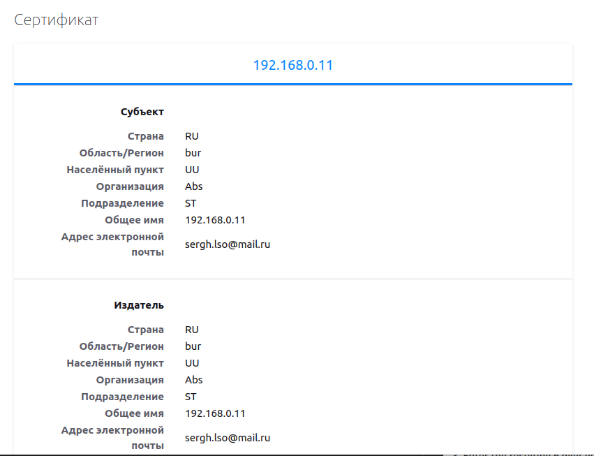
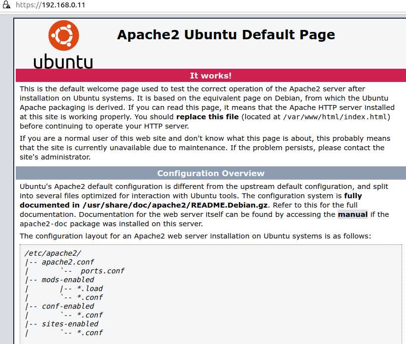
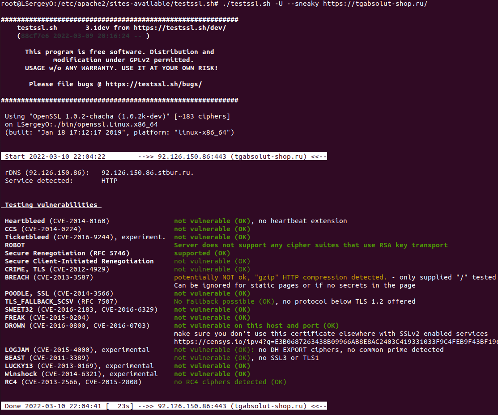
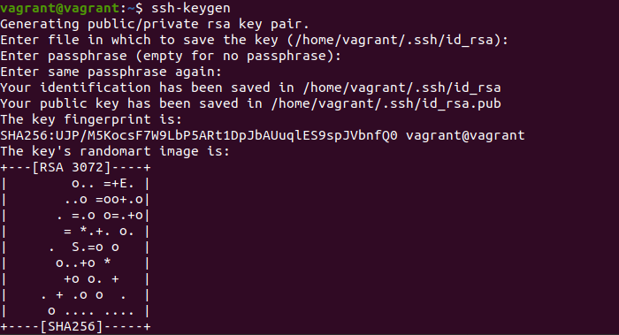
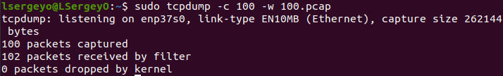
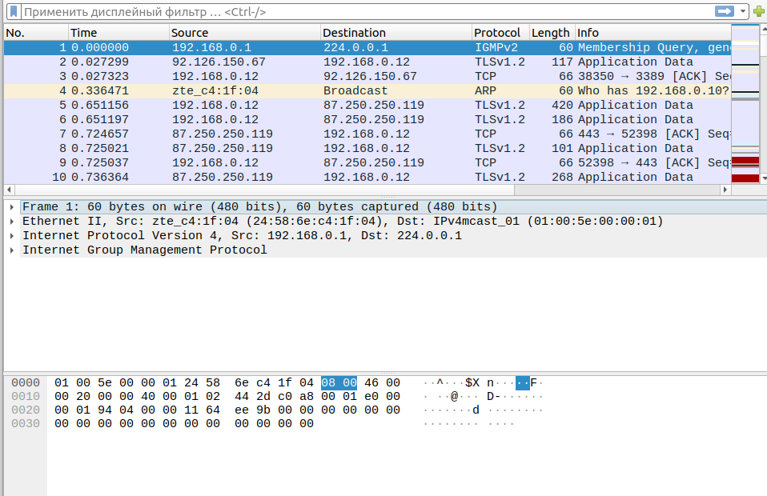

# devops-netology_3.9  
1. 
  

2. 
  

3. 
  

  

4. 
  

5. 
  
vagrant@vagrant:~$ ssh vagrant@10.0.2.15  

6. vagrant@vagrant:~/.ssh$ sudo mv ~/.ssh/id_rsa ~/.ssh/id_rsa_1  
vagrant@vagrant:~/.ssh$ sudo vim ~/.ssh/config  
- Host test1
- HostName 10.0.2.15  
- User vagrant  
- Port 22  
- IdentityFile ~/.ssh/id_rsa_1  

7. 
  
  